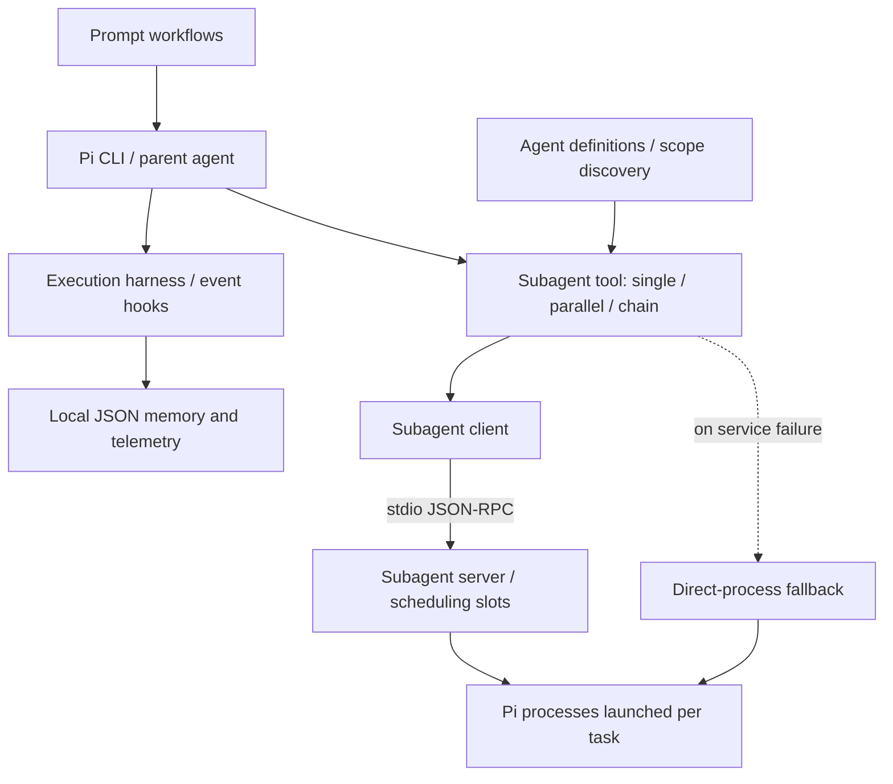

# pi-workbench

[English](README.md) · [简体中文](README.zh-CN.md)

**From an unfamiliar codebase to a file-backed implementation plan.** Experimental agent workflows for [Pi](https://github.com/earendil-works/pi).

Start with **`/scout-and-plan`**: scout gathers code context, then planner proposes concrete changes with source references. The workspace also explores implementation/review workflows, execution guidance, and persistent local memory.

> **Status: Experimental / `pending-rights-review`.** Local additions and some upstream-derived modifications still need provenance and license confirmation. See [Provenance & License](#provenance--license).

[Try the Sample](#try-the-planning-workflow) · [Agents](#built-in-agents) · [Workflows](#prompt-workflows) · [Usage](#usage) · [Limitations](#known-limitations)

## Try the Planning Workflow

**Demo status: offline preparation complete; real model execution and terminal recording are pending.** No GIF or measured agent result is available yet. Use the [synthetic reading-list CLI](public/examples/scout-plan-project/README.md) to plan a `--tag` filter without implementing it. The [human-written acceptance rubric](public/examples/scout-plan-project/EXPECTED_PLAN.md) shows what to check; it is not model output and is kept out of the generated agent workspace.

With Node.js and Pi 0.84.2 already installed, run from this repository's root:

```console
node scripts/create-demo.mjs
node scripts/check-demo.mjs
```

This creates a new ignored `.local-audit/scout-plan-demo/` using an explicit file list, then checks the sample and copy integrity without model calls. It refuses to overwrite an existing directory. No npm installation is needed for the sample.

After configuring and checking the parent and child models, start Pi in that directory:

```console
cd .local-audit/scout-plan-demo
pi --no-extensions -e ./.pi/extensions/subagent/index.ts
```

Then enter:

```text
/scout-and-plan Plan a case-insensitive --tag filter for this reading-list CLI; combine it with --status, reject blank or missing tags, and cite source files and lines. Do not modify files. Read TASK.md for requirements.
```

The intended result is a scout → planner handoff and an actionable plan. This model run has not been performed. See the [demo guide](docs/DEMO.md) for the expected output criteria, model configuration caveats, integrity check after a run, and 30–45 second recording outline. Setup time and model execution time have not been measured.

## Overview

This workspace runs inside an installed Pi CLI. It is not a Pi fork, a standalone coding agent, or the full Pi source repository, and it is not an official Pi project.

It brings together two experiments:

- **Execution guidance:** detect repetitive exploration, suggest the next execution phase, and carry local patterns into later tasks.
- **Task delegation:** separate reconnaissance, planning, implementation, and review into roles with their own task context.

The repository contains extensions, agent definitions, and prompt templates. Real model-driven workflows have not been validated end to end.

## What This Adds to Pi's Example

Pi already provides a [subagent example](https://github.com/earendil-works/pi/tree/v0.84.1/packages/coding-agent/examples/extensions/subagent). Single, parallel, and chain delegation are upstream capabilities, not original inventions of this project.

| Area | Boundary |
| --- | --- |
| Agent discovery, delegation modes, role prompts | Includes upstream material and local adaptations; see [Provenance](docs/PROVENANCE.md) |
| JSON-RPC scheduling, task display, additional workflow templates | Local changes included here; provenance/rights and real execution still need confirmation |
| Execution harness and local memory | Separate experiments; not loaded by the planning sample and not backed by performance claims |
| Synthetic sample, preparation scripts, plan rubric | Reproducible offline preparation added here; does not establish workflow success |

## Features

### Execution Harness

The [execution harness](public/extensions/deepseek-harness.ts) attaches to Pi events automatically; there is no separate `/harness` command.

| Capability | Current behavior |
| --- | --- |
| Phase guidance | Infers `init`, `explore`, `edit`, `verify`, `done`, or `stuck` from tool activity and verification signals |
| Tool-call discipline | Detects identical calls and long exploration streaks; can block calls and return phase-aware guidance |
| Character accounting and output trimming | Tracks read, exploration, and written characters; trims large text results using a configured 16,000-character threshold |
| Verification hints | Classifies command output using pass/fail text patterns and records the result |
| Persistent memory | Stores patterns, learned skills, file knowledge, and session summaries in local JSON; injects matching context into later tasks |
| Project context | Detects project archetypes and repository context to select exploration guidance |
| Execution records | Writes telemetry, tracks tool effectiveness and failure patterns, and displays a session summary in the TUI |

Verification parsing is **heuristic**, not a deterministic verifier. Character accounting is not a model token limit; configured exploration and total-character budgets are not enforced by the current hooks. Protected-path matching is not a security sandbox.

### Subagent Orchestration

The [subagent extension](public/extensions/subagent/index.ts) registers the `subagent` tool with three mutually exclusive modes:

| Mode | Parameters | Behavior |
| --- | --- | --- |
| Single | `agent` + `task` | Delegate one task to a named agent |
| Parallel | `tasks` | Run independent agent/task pairs with a concurrency limit |
| Chain | `chain` | Run sequentially; replace `{previous}` with the preceding agent's text output |

The source sets **`MAX_PARALLEL_TASKS = 8`** and **`MAX_CONCURRENCY = 4`**. These are configured limits, not measured throughput or success rates.

Agent discovery supports `user` (Pi's user agent directory, the default), `project` (the nearest `.pi/agents/` directory found from the working directory upward), and `both` (project definitions override duplicate user names).

Project-local agents require confirmation by default when an interactive UI is available. The TUI includes task status, completion summaries, and a status badge. Calls attempt the [client](public/extensions/subagent/subagent-client.ts) / [server](public/extensions/subagent/subagent-server.ts) path over stdio JSON-RPC, with a direct-process fallback on failure.

**Worker slots are scheduling slots; individual tasks still launch Pi processes.** They do not permanently reuse a model context. Configuration and cancellation behavior differ between the service and fallback paths.

## Built-in Agents

Four [agent definitions](public/agents/) are included:

| Agent | Purpose defined by its prompt |
| --- | --- |
| [`scout`](public/agents/scout.md) | Inspect a codebase and return compressed findings, file references, dependencies, and a starting point for handoff |
| [`planner`](public/agents/planner.md) | Produce a concrete implementation plan from context and requirements; instructed not to modify code |
| [`worker`](public/agents/worker.md) | Execute delegated tasks and report completed work, changed files, and handoff notes |
| [`reviewer`](public/agents/reviewer.md) | Review correctness, security, and maintainability; return actionable findings with file and line references using read-only commands |

The public definitions have no fixed model override. Role instructions describe intended behavior; they do not establish enforced tool permissions.

## Prompt Workflows

Seven [prompt templates](public/prompts/) describe delegation sequences. Each requests `agentScope: "project"` and project-agent confirmation.

| Prompt | Agent sequence | Intended task |
| --- | --- | --- |
| [`/scout-and-plan`](public/prompts/scout-and-plan.md) | `scout → planner` | Inspect and plan without implementation |
| [`/implement`](public/prompts/implement.md) | `scout → planner → worker` | Gather context, plan, and implement |
| [`/implement-and-review`](public/prompts/implement-and-review.md) | `worker → reviewer → worker` | Implement, review, and apply feedback |
| [`/debug`](public/prompts/debug.md) | `scout → worker` | Investigate a bug, then fix and verify it |
| [`/document`](public/prompts/document.md) | `scout → worker` | Read the code, then generate documentation |
| [`/refactor`](public/prompts/refactor.md) | `scout → planner → worker` | Plan and carry out a focused refactor |
| [`/test`](public/prompts/test.md) | `worker → worker` | Implement a change, then add and run tests |

Prompt workflows are **model-driven orchestration instructions**, not deterministic workflow programs. A chain passes context through `{previous}`; a prompt alone does not guarantee the expected tool calls.

## How It Works



Pi discovers the copied extensions in the test project's `.pi/extensions/`. The harness observes execution events; the subagent tool combines a role prompt and task, attempts delegation, and returns results to the parent. The memory store is local JSON, with no database or vector store.

## Quick Start

The following setup reflects the currently validated **Windows / PowerShell** path. Release checks used Node.js **24.15.0**, npm **11.12.1**, and `@earendil-works/pi-coding-agent` **0.84.2**. That Pi package requires Node.js **>=22.19.0**. These are observed baseline versions, not a verified compatibility range.

The repository root has **no `package.json` or lockfile**. Do not run `npm install` or `npm ci` there. If Pi 0.84.2 is already installed, skip the installation command:

```console
npm install -g --ignore-scripts @earendil-works/pi-coding-agent@0.84.2
node --version
pi --version
```

The package name and installed baseline were checked; a fresh global installation was not part of release validation. See [Installation](docs/INSTALLATION.md) for dependency, configuration, and uninstall details.

From the repository root, copy the extensions and templates into a **new test project**:

```powershell
New-Item -ItemType Directory -Path ./sandbox-project -ErrorAction Stop | Out-Null
New-Item -ItemType Directory -Path ./sandbox-project/.pi -ErrorAction Stop | Out-Null
Copy-Item -LiteralPath ./public/extensions -Destination ./sandbox-project/.pi/extensions -Recurse -ErrorAction Stop
Copy-Item -LiteralPath ./public/agents -Destination ./sandbox-project/.pi/agents -Recurse -ErrorAction Stop
Copy-Item -LiteralPath ./public/prompts -Destination ./sandbox-project/.pi/prompts -Recurse -ErrorAction Stop
Copy-Item -LiteralPath ./public/examples/settings.example.json -Destination ./sandbox-project/.pi/settings.json -ErrorAction Stop
Push-Location ./sandbox-project
pi
Pop-Location
```

Pi discovers the top-level extension and the subagent directory's `index.ts`. The empty settings example does not configure a model or credentials. Configure your chosen provider through Pi before running real tasks, and review the service-path limitations below. Real tasks can make model requests and modify files; they were not exercised during release validation.

> TODO: add macOS/Linux instructions after validation.

## Usage

With the project templates loaded, enter a prompt command in Pi:

```text
/scout-and-plan Inspect this synthetic sample project and propose a small change; do not implement it.
/implement-and-review Implement the agreed change in this synthetic sample project, then review it.
```

The JSON below contains **`subagent` tool arguments**, not shell commands or records of validated model runs. Choose exactly one mode: `agent` + `task`, `tasks`, or `chain`. Use `project` to select the copied roles; the tool's default is `user`.

Single task:

```json
{
  "agent": "scout",
  "task": "Inspect the synthetic sample project and summarize its structure without changing files.",
  "agentScope": "project",
  "confirmProjectAgents": true
}
```

Parallel tasks:

```json
{
  "tasks": [
    { "agent": "scout", "task": "Summarize the synthetic sample project's source layout." },
    { "agent": "reviewer", "task": "Inspect the synthetic sample project's current changes and report findings without editing files." }
  ],
  "agentScope": "project",
  "confirmProjectAgents": true
}
```

Chain with an explicit handoff:

```json
{
  "chain": [
    { "agent": "scout", "task": "Inspect the synthetic sample project and return context for planning." },
    { "agent": "planner", "task": "Using this context, propose a small implementation plan without changing files: {previous}" }
  ],
  "agentScope": "project",
  "confirmProjectAgents": true
}
```

Each task or chain step can supply `cwd`. Project-agent confirmation is only shown in interactive UI mode; it does not establish a permission boundary. See [Usage](docs/USAGE.md) for details.

## Demo

The featured scenario is `/scout-and-plan` on the [synthetic sample](public/examples/scout-plan-project/README.md). [Reproduction and recording instructions](docs/DEMO.md) are available. **Real execution, output capture, and a terminal GIF remain pending.** The acceptance rubric is manually authored, and sample tests are separate from Pi integration checks. `/implement-and-review` is a follow-up after this scenario has been validated.

## Local Data & Safety

When the working directory contains `.pi`, the harness uses:

| Path | Data |
| --- | --- |
| `.pi/deepseek-harness/events.jsonl` | Tool events, telemetry, and execution summaries |
| `.pi/deepseek-harness/memory/memory.json` | Patterns, learned skills, file knowledge, session summaries, project context, and failure/tool statistics |
| `.pi/deepseek-harness/skills/` | Directory reserved for skill files; independent skill loading is currently a stub |

Without a project `.pi`, these locations fall back to `pi/deepseek-harness/` beneath the home directory selected by `HOME` or `USERPROFILE`.

Runtime records may contain task context, paths, tool inputs, and verification output. **Do not commit real runtime data as examples.** The checked-in [memory example](public/examples/memory.synthetic.json) is an empty synthetic structure, not real memory or a test result. The [settings example](public/examples/settings.example.json) contains no credentials.

The repository uses an explicit public allowlist. Its ignore rules do not automatically protect a different project where the extensions are installed; keep runtime files out of that project's commits too. Protected-path checks are execution guidance, not OS sandboxing.

## Known Limitations

- **Dependencies:** no root package or lockfile. The client invokes unpinned `npx tsx`, which may download code and need network access; independent service module resolution has not been validated like Pi's extension loader.
- **Validation:** release checks covered syntax, registration, configuration/discovery, and prompt parsing/expansion. Real model requests, full workflows, cancellation, timeout, failure recovery, and cleanup still need end-to-end testing.
- **Service vs. fallback:** the service request does not forward role `model` / `tools` settings or the caller's cancellation signal; the fallback accepts them. Intended role restrictions and model inheritance are not guaranteed across both paths.
- **Process launch:** Windows `npx`, Pi command wrappers, and Node-based launch branches need further end-to-end validation. Worker slots do not preserve model contexts across tasks.
- **Heuristics:** output text can be misclassified as verification success. Phase labels and learned patterns inherit that uncertainty. Character budget configuration is not a hard execution or token cap.
- **Memory:** records can contain sensitive context. The JSON writer has no explicit lock or atomic update; concurrent writers have not been validated. Learned skills are mainly embedded in memory JSON, not loaded from independent skill files.
- **Permissions and rights:** role instructions, confirmations, and protected-path matching are not a security sandbox. Provenance and licensing remain incomplete for local additions and modifications.

## Project Structure

```text
README.md
README.zh-CN.md                    # Simplified Chinese README
docs/                             # Installation, usage, evidence, provenance
public/
  extensions/
    deepseek-harness.ts
    subagent/                     # Tool, agent discovery, client, server
  agents/                         # Four role definitions
  prompts/                        # Seven model-driven workflows
  examples/                       # Synthetic CLI, empty settings/memory, optional preferences
  licenses/PI-MIT.txt              # Confirmed upstream Pi license
  manifest.json                   # Explicit public candidate file list
scripts/
  create-demo.mjs                  # Explicit offline sample preparation
  check-demo.mjs                   # Sample baseline and copy integrity checks
  prepare-public-release.py        # Offline check and local candidate export
.gitignore                        # Exact public allowlist
```

See [Project Structure](docs/PROJECT_STRUCTURE.md) for the original workspace boundary and locally retained material. This repository contains the curated candidate, not its private operational files or runtime data.

## Release Candidate Checks

Requires Python **3.10+** and only its standard library. From the repository root:

```console
python scripts/prepare-public-release.py --check
python scripts/prepare-public-release.py --output .local-audit/release-candidate
```

The check validates manifest paths and status, rejects symlinks or unexpected binary/large content, scans for selected sensitive patterns, parses JSON and Python, checks relative Markdown links, and compares candidate files and ignore rules with the manifest.

Export first runs the checks, then copies only listed files into a new directory beneath `.local-audit/` and verifies copy hashes. It refuses to overwrite an existing output directory.

The script does not publish packages, push Git, grant publication rights, or prove that no secrets exist. A passing result is a candidate-file check, not a model-workflow test. See [Release Validation](docs/PUBLIC_RELEASE.md) for evidence and remaining work.

## Documentation

Detailed notes are currently written in Chinese.

| Document | Contents |
| --- | --- |
| [Demo Guide](docs/DEMO.md) | Featured planning scenario, synthetic fixture, acceptance rubric, and recording checklist |
| [Installation](docs/INSTALLATION.md) | Baseline, Windows setup, configuration, disabling and uninstalling |
| [Usage](docs/USAGE.md) | Tool arguments, harness behavior, runtime data, and service-path boundaries |
| [Project Structure](docs/PROJECT_STRUCTURE.md) | Public candidate layout and original workspace separation |
| [Release Validation](docs/PUBLIC_RELEASE.md) | Actual checks, verification limits, and remaining work |
| [Provenance](docs/PROVENANCE.md) | Upstream comparisons and per-file ownership questions |
| [Third-party Notices](docs/THIRD_PARTY_NOTICES.md) | Copyright, upstream license, and third-party boundaries |

## Contributing

- Keep changes focused; include reproduction steps and a relevant check.
- Document the source and provenance of added or adapted material.
- Use synthetic data only; exclude credentials, real telemetry, sessions, and private memory.
- Keep the public manifest and exact ignore rules synchronized when adding files.

TODO: add `CONTRIBUTING.md` after contribution and licensing policy is finalized.

## Provenance & License

Confirmed upstream Pi material is MIT licensed, but local additions and some upstream-derived modifications still require provenance and license confirmation. The complete upstream copyright and license text is preserved in [PI-MIT.txt](public/licenses/PI-MIT.txt).

The [manifest](public/manifest.json) retains `publication_status: "pending-rights-review"`; this repository has no blanket MIT license. The subagent example comparisons use Pi v0.84.1, while the observed runtime baseline is Pi 0.84.2. See [Provenance](docs/PROVENANCE.md) and [Third-party Notices](docs/THIRD_PARTY_NOTICES.md) for confirmed upstream content and unresolved local work.
