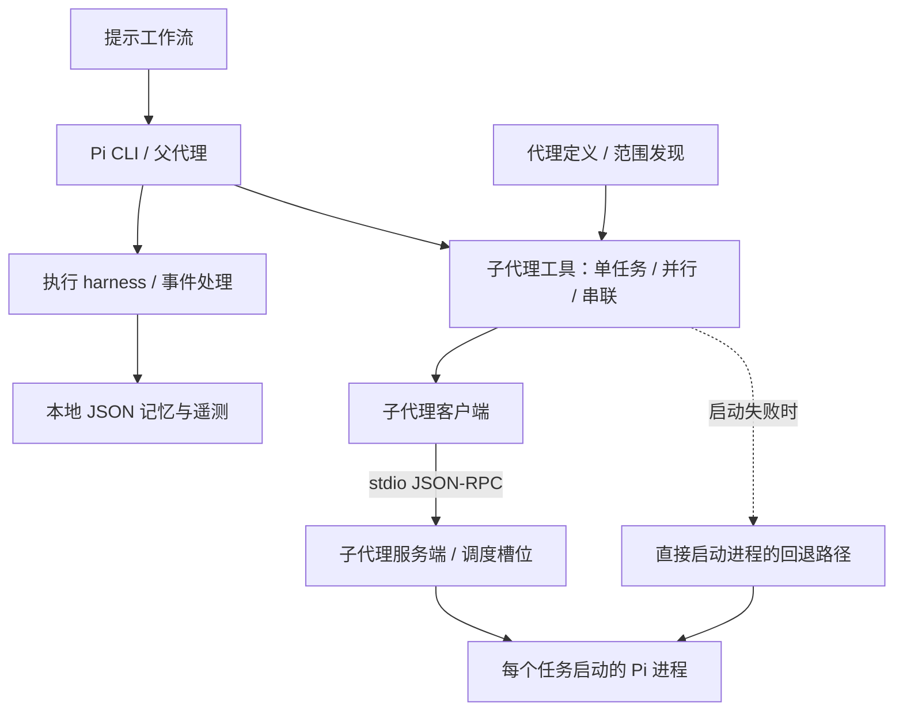

# pi-workbench

[English](README.md) · [简体中文](README.zh-CN.md)

**从陌生代码库，到有文件依据的实施计划。** 面向 [Pi](https://github.com/earendil-works/pi) 的实验性代理工作流。

先从 **`/scout-and-plan`** 开始：scout 收集代码上下文，planner 再提出带源码引用的具体改动计划。工作区还探索实施与审查工作流、执行引导及本地持久记忆。

> **状态：实验性 / `pending-rights-review`。** 本地新增内容和部分上游改编内容仍需确认来源与授权。详见[来源与许可证](#来源与许可证)。

[试用示例](#快速试用规划工作流) · [内置代理](#内置代理) · [提示工作流](#提示工作流) · [使用方法](#使用方法) · [已知限制](#已知限制)

## 快速试用规划工作流

**演示状态：离线准备完成；真实模型执行与终端录制待完成。** 目前没有 GIF 或实测代理结果。使用[合成阅读清单 CLI](public/examples/scout-plan-project/README.md)，规划 `--tag` 筛选功能，不实施修改。[人工验收标准](public/examples/scout-plan-project/EXPECTED_PLAN.md)说明应检查什么；它不是模型输出，也不会复制到生成的代理工作目录。

已经安装 Node.js 和 Pi 0.84.2 时，在仓库根目录执行：

```console
node scripts/create-demo.mjs
node scripts/check-demo.mjs
```

这会按显式文件清单创建被忽略的新目录 `.local-audit/scout-plan-demo/`，再检查示例及副本完整性，不请求模型。已有目录不会被覆盖。示例无需安装 npm 依赖。

配置并核对父代理与子代理模型后，在该目录启动 Pi：

```console
cd .local-audit/scout-plan-demo
pi --no-extensions -e ./.pi/extensions/subagent/index.ts
```

然后输入：

```text
/scout-and-plan Plan a case-insensitive --tag filter for this reading-list CLI; combine it with --status, reject blank or missing tags, and cite source files and lines. Do not modify files. Read TASK.md for requirements.
```

预期得到 scout → planner 的交接和可执行的计划；这次模型运行尚未执行。[演示指南](docs/DEMO.md)提供预期输出标准、模型配置注意事项、运行后的完整性检查及 30～45 秒录制安排。准备耗时和模型执行耗时均未实测。

## 项目概览

本工作区运行在已安装的 Pi CLI 中。它不是 Pi 分支、独立编码代理或完整的 Pi 源码仓库，也不是官方 Pi 项目。

项目包含两类实验：

- **执行引导：** 识别重复探索，提示下一步执行阶段，并把本地积累的模式带入后续任务。
- **任务委派：** 将代码侦察、规划、实施和审查分配给拥有各自任务上下文的代理角色。

仓库提供扩展、代理定义和提示模板。真实模型驱动的工作流尚未完成端到端验证。

## 相比 Pi 官方示例增加了什么

Pi 已有[子代理示例](https://github.com/earendil-works/pi/tree/v0.84.1/packages/coding-agent/examples/extensions/subagent)。单任务、并行和串联委派是上游能力，不作为本项目的原创能力宣传。

| 内容 | 边界 |
| --- | --- |
| 代理发现、委派模式和角色提示 | 包含上游内容及本地改编；见[来源与归属](docs/PROVENANCE.md) |
| JSON-RPC 调度、任务展示和新增工作流模板 | 仓库包含的本地改造；来源／授权和真实运行仍需确认 |
| 执行 harness 与本地记忆 | 独立实验；规划示例不加载，不宣传未经验证的性能提升 |
| 合成示例、准备脚本和计划验收标准 | 本次新增的可复现离线准备材料，不代表工作流运行成功 |

## 功能

### 执行 Harness

[执行 harness](public/extensions/deepseek-harness.ts) 会自动接入 Pi 事件，无需单独运行 `/harness` 命令。

| 能力 | 当前行为 |
| --- | --- |
| 阶段引导 | 根据工具活动和验证信号，推断 `init`、`explore`、`edit`、`verify`、`done` 或 `stuck` 阶段 |
| 工具调用约束 | 识别相同调用和连续探索；可以阻止调用并返回符合当前阶段的提示 |
| 字符统计与输出裁剪 | 统计读取、探索和写入字符数；按配置的 16,000 字符阈值裁剪较大的文本结果 |
| 验证提示 | 根据通过／失败的文本模式分类命令输出，并记录结果 |
| 持久记忆 | 将模式、学习到的技能、文件知识和会话摘要保存在本地 JSON 中；在后续任务中注入匹配的上下文 |
| 项目上下文 | 识别项目类型和仓库上下文，选择探索提示 |
| 执行记录 | 写入遥测，记录工具有效性和失败模式，并在终端界面中展示会话摘要 |

验证解析依赖**启发式规则**，不构成确定性的验证器。字符统计不等于模型 token 上限；当前事件处理逻辑未强制执行配置中的探索字符预算和总字符预算。受保护路径匹配不构成安全沙箱。

### 子代理编排

[子代理扩展](public/extensions/subagent/index.ts) 注册 `subagent` 工具，提供三种互斥模式：

| 模式 | 参数 | 行为 |
| --- | --- | --- |
| 单任务 | `agent` + `task` | 将一个任务交给指定代理 |
| 并行 | `tasks` | 在并发限制内运行独立的代理与任务组合 |
| 串联 | `chain` | 顺序执行；将 `{previous}` 替换为前一个代理的文本输出 |

源码设置 **`MAX_PARALLEL_TASKS = 8`** 和 **`MAX_CONCURRENCY = 4`**。这些是配置上限，不是实测吞吐量或成功率。

代理发现支持三种范围：`user` 为 Pi 的用户代理目录，也是默认值；`project` 为从工作目录向上查找的最近 `.pi/agents/` 目录；`both` 同时使用两者，同名时项目定义覆盖用户定义。

在可用的交互界面中，项目级代理默认需要确认。终端界面包含任务状态、完成摘要和状态标记。调用通过已安装的 Node 和 stdio JSON-RPC 启动[客户端](public/extensions/subagent/subagent-client.ts)与[服务端](public/extensions/subagent/subagent-server.ts)。启动失败时可回退为直接启动进程；已提交的任务不会自动重复执行。

**Worker 槽位用于调度；每个任务仍会启动 Pi 进程。** 槽位不会持续复用模型上下文。两条路径共享[进程处理逻辑](public/extensions/subagent/subagent-process.ts)，传递角色配置并支持取消。子进程关闭自动扩展加载，避免递归加载。

## 内置代理

项目包含四份[代理定义](public/agents/)：

| 代理 | 提示中定义的职责 |
| --- | --- |
| [`scout`](public/agents/scout.md) | 侦察代码库，返回压缩后的发现、文件引用、依赖及后续交接的起点 |
| [`planner`](public/agents/planner.md) | 根据上下文和需求给出具体实施计划；提示要求不修改代码 |
| [`worker`](public/agents/worker.md) | 执行委派任务，汇报完成内容、修改文件和交接说明 |
| [`reviewer`](public/agents/reviewer.md) | 审查正确性、安全性和可维护性；使用只读命令，返回带文件和行号的可执行建议 |

公开定义没有固定模型覆盖项。角色未指定模型时，工具传递父代理选定的提供商与模型。声明的工具会传递给 Pi CLI 白名单。角色提示描述预期行为，不构成操作系统权限边界。

## 提示工作流

七份[提示模板](public/prompts/)描述了任务委派顺序，均要求 `agentScope: "project"` 和项目代理确认。

| 提示命令 | 代理顺序 | 预期任务 |
| --- | --- | --- |
| [`/scout-and-plan`](public/prompts/scout-and-plan.md) | `scout → planner` | 侦察并规划，不实施修改 |
| [`/implement`](public/prompts/implement.md) | `scout → planner → worker` | 收集上下文、规划并实施 |
| [`/implement-and-review`](public/prompts/implement-and-review.md) | `worker → reviewer → worker` | 实施、审查并处理反馈 |
| [`/debug`](public/prompts/debug.md) | `scout → worker` | 调查问题，再修复并验证 |
| [`/document`](public/prompts/document.md) | `scout → worker` | 阅读代码，再生成文档 |
| [`/refactor`](public/prompts/refactor.md) | `scout → planner → worker` | 规划并完成聚焦的重构 |
| [`/test`](public/prompts/test.md) | `worker → worker` | 实施修改，再添加并运行测试 |

这些工作流是**由模型执行的编排提示**，不是确定性的工作流程序。串联通过 `{previous}` 传递上下文；仅有提示模板并不能保证模型按预期调用工具。

## 工作原理



Pi 从测试项目的 `.pi/extensions/` 中发现复制的扩展。Harness 观察执行事件；子代理工具组合角色提示与任务，尝试委派，并将结果返回父代理。记忆保存在本地 JSON 中，不使用数据库或向量存储。

## 快速开始

以下操作对应目前已验证的 **Windows / PowerShell** 路径。公开候选检查使用 Node.js **24.15.0**、npm **11.12.1** 和 `@earendil-works/pi-coding-agent` **0.84.2**。该 Pi 包要求 Node.js **>=22.19.0**。这些是实际观察到的基线版本，不代表已验证的兼容范围。

仓库根目录**没有 `package.json` 或 lockfile**，请勿在根目录运行 `npm install` 或 `npm ci`。如果已经安装 Pi 0.84.2，可跳过安装命令：

```console
npm install -g --ignore-scripts @earendil-works/pi-coding-agent@0.84.2
node --version
pi --version
```

包名和已安装基线已核对；公开候选验证未执行全新的全局安装。依赖、配置及卸载细节见[安装说明](docs/INSTALLATION.md)。

从仓库根目录，将扩展和模板复制到一个**新的测试项目**：

```powershell
New-Item -ItemType Directory -Path ./sandbox-project -ErrorAction Stop | Out-Null
New-Item -ItemType Directory -Path ./sandbox-project/.pi -ErrorAction Stop | Out-Null
Copy-Item -LiteralPath ./public/extensions -Destination ./sandbox-project/.pi/extensions -Recurse -ErrorAction Stop
Copy-Item -LiteralPath ./public/agents -Destination ./sandbox-project/.pi/agents -Recurse -ErrorAction Stop
Copy-Item -LiteralPath ./public/prompts -Destination ./sandbox-project/.pi/prompts -Recurse -ErrorAction Stop
Copy-Item -LiteralPath ./public/examples/settings.example.json -Destination ./sandbox-project/.pi/settings.json -ErrorAction Stop
Push-Location ./sandbox-project
pi
Pop-Location
```

Pi 会发现顶层扩展和子代理目录的 `index.ts`。空配置示例不会配置模型或凭据。运行真实任务前，请通过 Pi 配置所选提供商，并阅读下方服务路径的限制。真实任务可能请求模型并修改文件；公开候选验证未执行这些任务。

> TODO：验证后补充 macOS/Linux 操作说明。

## 使用方法

加载项目模板后，在 Pi 中输入提示命令：

```text
/scout-and-plan 检查这个合成示例项目，提出一项小修改的计划；不要实施。
/implement-and-review 在这个合成示例项目中实施已确认的修改，然后审查。
```

以下 JSON 是 **`subagent` 工具参数**，不是 shell 命令，也不是已验证的模型运行记录。请仅选择一种模式：`agent` + `task`、`tasks` 或 `chain`。选择复制的项目角色时使用 `project`；工具默认使用 `user`。

单任务：

```json
{
  "agent": "scout",
  "task": "检查合成示例项目，概括其结构，不修改文件。",
  "agentScope": "project",
  "confirmProjectAgents": true
}
```

并行任务：

```json
{
  "tasks": [
    { "agent": "scout", "task": "概括合成示例项目的源码布局。" },
    { "agent": "reviewer", "task": "检查合成示例项目的当前修改，报告发现，不编辑文件。" }
  ],
  "agentScope": "project",
  "confirmProjectAgents": true
}
```

带明确交接的串联任务：

```json
{
  "chain": [
    { "agent": "scout", "task": "检查合成示例项目，返回用于规划的上下文。" },
    { "agent": "planner", "task": "根据以下上下文提出一份小规模实施计划，不修改文件：{previous}" }
  ],
  "agentScope": "project",
  "confirmProjectAgents": true
}
```

每个任务或串联步骤都可以提供 `cwd`。项目代理确认仅在交互界面模式中展示，不构成权限边界。更多细节见[使用说明](docs/USAGE.md)。

## 演示

主打场景是在[合成示例](public/examples/scout-plan-project/README.md)上使用 `/scout-and-plan`。[复现与录制说明](docs/DEMO.md)已提供。**真实执行、输出采集和终端 GIF 仍待完成。** 验收标准为人工编写，示例测试与 Pi 集成检查分别记录。该场景验证后，再展示 `/implement-and-review`。

## 本地数据与安全

当工作目录包含 `.pi` 时，harness 使用以下路径：

| 路径 | 数据 |
| --- | --- |
| `.pi/deepseek-harness/events.jsonl` | 工具事件、遥测和执行摘要 |
| `.pi/deepseek-harness/memory/memory.json` | 模式、学习到的技能、文件知识、会话摘要、项目上下文及失败／工具统计 |
| `.pi/deepseek-harness/skills/` | 预留的技能文件目录；独立技能加载目前仍是占位实现 |

如果项目中没有 `.pi`，这些位置会回退到由 `HOME` 或 `USERPROFILE` 选定的用户主目录下的 `pi/deepseek-harness/`。

运行记录可能包含任务上下文、路径、工具输入和验证输出。**不要将真实运行数据作为示例提交。** 仓库中的[记忆示例](public/examples/memory.synthetic.json)是空的合成结构，不是真实记忆或测试结果。[配置示例](public/examples/settings.example.json)不含凭据。

本仓库采用明确的公开文件白名单。其忽略规则不会自动保护安装扩展的其他项目；请在目标项目中同样避免提交运行数据。受保护路径检查是执行引导，不是操作系统沙箱。

## 已知限制

- **依赖：** 根目录没有 package 或 lockfile。Pi 加载器提供扩展使用的宿主模块。服务使用 Node 原生 TypeScript 支持和内置模块，不调用 `npx` 或下载运行器。已测试服务基线为 Windows 上的 Node.js 24.15.0。
- **验证范围：** 19 项进程／协议测试使用合成子 CLI；另核对了 Pi 0.84.2 版本／帮助、扩展加载和合成工具入口交接。真实模型请求、模型驱动工作流、提供商侧取消及实际终端界面仍需端到端验证。
- **服务与回退路径：** 两者均传递角色的 `model` / `tools` 配置，并使用共享进程处理逻辑。启动失败可回退；执行结果未知时报告失败，不自动重复执行。提供商认证及可用性仍须在运行时满足。
- **进程启动：** 根据包元数据或 `PI_SUBAGENT_PI_PATH` 定位已安装 Pi CLI，不把命令包装器或服务脚本当作任务入口。子扩展被禁用，因此仅由扩展注册的提供商在子进程中不可用。正常关闭会清理临时提示；操作系统或进程被强行终止时可能遗留临时文件。Worker 槽位不会保留跨任务的模型上下文。
- **启发式规则：** 输出文本可能被误判为验证成功，阶段标签和学习到的模式也受此影响。字符预算配置不是强制执行上限或 token 上限。
- **记忆：** 记录可能含敏感上下文。JSON 写入没有显式锁或原子更新；并发写入尚未验证。学习到的技能主要保存在记忆 JSON 中，不是从独立技能文件加载。
- **权限与授权：** 角色提示、确认和受保护路径匹配不构成安全沙箱。本地新增与改编内容的来源和许可证仍未全部确认。

## 目录结构

```text
README.md                         # 英文首页
README.zh-CN.md                    # 简体中文首页
docs/                             # 安装、使用、验证证据与来源说明
public/
  extensions/
    deepseek-harness.ts
    subagent/                     # 工具、代理发现、客户端与服务端
  agents/                         # 四种角色定义
  prompts/                        # 七种模型驱动的工作流
  examples/                       # 合成 CLI、空配置／记忆与可选偏好
  licenses/PI-MIT.txt              # 已确认的上游 Pi 许可证
  manifest.json                   # 明确的公开候选文件清单
scripts/
  create-demo.mjs                  # 按显式清单准备离线示例
  check-demo.mjs                   # 示例基线与副本完整性检查
  prepare-public-release.py        # 离线检查与本地候选副本导出
tests/
  subagent.test.mjs                # 合成进程／协议回归测试
  fixtures/                       # 合成子进程与服务夹具
.gitignore                        # 精确的公开文件白名单
```

原始工作区边界及本地保留内容见[目录结构说明](docs/PROJECT_STRUCTURE.md)。本仓库包含整理后的候选文件，不包含原始工作区的私有运维文件或运行数据。

## 公开候选检查

需要 Python **3.10+**，仅使用标准库。在仓库根目录运行：

```console
python scripts/prepare-public-release.py --check
python scripts/prepare-public-release.py --output .local-audit/release-candidate
```

检查会验证清单路径和状态，拒绝符号链接、意外的二进制或过大内容，扫描指定敏感信息模式，解析 JSON 和 Python，检查相对 Markdown 链接，并比对候选文件、忽略规则和清单是否一致。

导出会先运行检查，再将清单中的文件复制到 `.local-audit/` 下的新目录，并验证副本哈希。已有输出目录不会被覆盖。

该脚本不发布包、不推送 Git、不赋予公开授权，也不能证明不存在任何秘密。检查通过代表候选文件检查通过，不代表模型工作流测试通过。实际证据和剩余事项见[公开前验收](docs/PUBLIC_RELEASE.md)。

使用已测试的 Node 基线运行不调用模型的行为检查：

```console
node --test tests/subagent.test.mjs
```

范围、实际 Pi 基础检查和剩余模型验证见[测试说明](docs/TESTING.md)。示例项目的四个测试与这 19 项进程／协议检查分别记录。

## 文档导航

详细说明目前使用中文。

| 文档 | 内容 |
| --- | --- |
| [演示指南](docs/DEMO.md) | 主打规划场景、合成示例、验收标准和录制清单 |
| [测试说明](docs/TESTING.md) | 不调用模型的进程／协议检查与实际 Pi 基础检查边界 |
| [安装说明](docs/INSTALLATION.md) | 环境基线、Windows 安装、配置、禁用和卸载 |
| [使用说明](docs/USAGE.md) | 工具参数、harness 行为、运行数据和服务路径边界 |
| [目录结构](docs/PROJECT_STRUCTURE.md) | 公开候选布局与原始工作区隔离 |
| [公开前验收](docs/PUBLIC_RELEASE.md) | 实际检查、验证限制和剩余事项 |
| [来源与归属](docs/PROVENANCE.md) | 上游比较和逐文件归属待确认项 |
| [第三方声明](docs/THIRD_PARTY_NOTICES.md) | 版权、上游许可证和第三方内容边界 |

## 贡献

- 聚焦具体改动，附上复现步骤和相关检查。
- 说明新增或改编材料的来源与归属。
- 仅使用合成数据；排除凭据、真实遥测、会话和私有记忆。
- 新增公开文件时，同步公开清单和精确忽略规则。

TODO：贡献与授权政策确定后，补充 `CONTRIBUTING.md`。

## 来源与许可证

已确认的上游 Pi 内容采用 MIT 许可证，但本地新增和部分上游改编内容仍需确认来源与授权。完整的上游版权与许可证文本保存在 [PI-MIT.txt](public/licenses/PI-MIT.txt)。

[文件清单](public/manifest.json)保留 `publication_status: "pending-rights-review"`；本仓库没有覆盖全部内容的统一 MIT 许可证。子代理示例比较使用 Pi v0.84.1，实际观察到的运行基线为 Pi 0.84.2。已确认的上游内容和未解决的本地归属问题见[来源与归属](docs/PROVENANCE.md)及[第三方声明](docs/THIRD_PARTY_NOTICES.md)。
